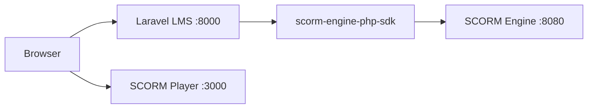
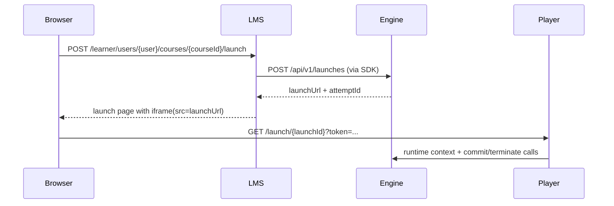

# example-lms-client

## Scope
Laravel LMS reference client that consumes:
- `scorm-engine` API through `scorm-engine-php-sdk`
- `player` launch URLs for SCORM runtime delivery

Repository app path: `lms-laravel/`.

## Runtime
- Default HTTP port: `8000`
- Engine target base URL: `http://localhost:8080/api/v1`
- Player target base URL: `http://localhost:3000`

## Architecture


## Request Flow (Learner Launch)


## Run
```bash
cd lms-laravel
composer install
php artisan key:generate
php artisan migrate
php artisan serve --host=0.0.0.0 --port=8000
```

Open `http://localhost:8000`.
