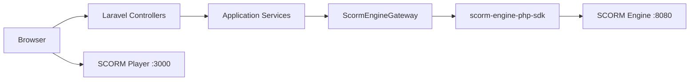
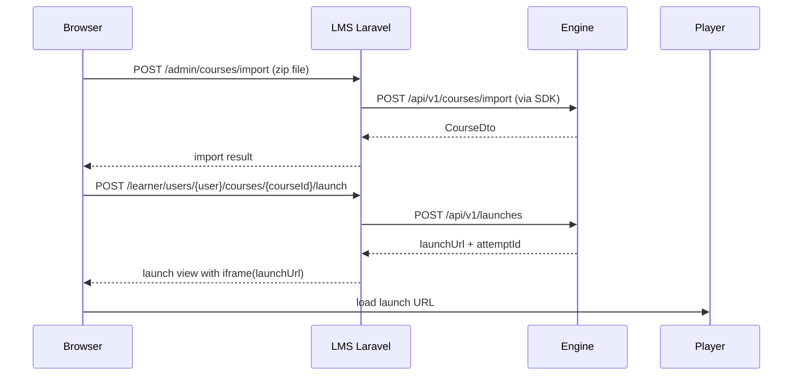

# lms-laravel

## Scope
Laravel LMS application for SCORM operations:
- admin course import
- admin user sync + enrollment
- learner launch page and progress/history views
- gateway integration with `scorm-engine-php-sdk`

## Runtime
- Default HTTP port: `8000`
- Engine base URL: `SCORM_ENGINE_BASE_URL` (default `http://localhost:8080/api/v1`)
- Player base URL: `SCORM_PLAYER_BASE_URL` (default `http://localhost:3000`)
- SCORM SDK package source: GitHub VCS repository (`ihu/scorm-engine-sdk`), pinned to `v1.0.0`

## Key Routes
- `GET /admin/courses`
- `POST /admin/courses/import`
- `GET /admin/users`
- `GET /admin/enrollments`
- `POST /learner/users/{user}/courses/{courseId}/launch`
- `GET /learner/users/{user}/progress`

## Architecture


## Request Flow (Import + Launch)


## Token Behavior (Local Dev)
- If `SCORM_ENGINE_ADMIN_TOKEN` is empty or expired, LMS tries to mint a fresh token from `POST /api/v1/auth/dev-token`.
- This fallback is active in `local` environment.

## Run
```bash
cd example-lms-client/lms-laravel
composer install
php artisan key:generate
php artisan migrate
php artisan serve --host=0.0.0.0 --port=8000
```
